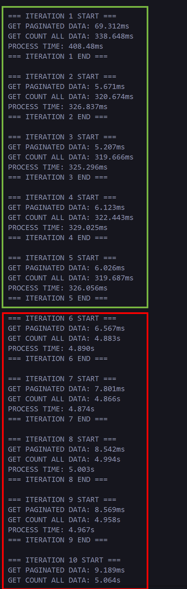

# PRISMA BUG REPRODUCE
This project for bug reproduce only, its simulate pagination query (get list data with offset and limit, also get total data) 

## Requirements
1. Nodejs Version 16+
2. PostgreSQL Server 14+

## Deployment
1. Clone / Download Project
2. Copy & Rename `.env.example` to `.env`
3. Change this line at `.env` file depending your configuration
    ```
    DB_HOST="localhost"
    DB_PORT="5432"
    DB_USER=""
    DB_NAME=""
    DB_PASS=""
    DB_SCHEMA="public"
    DB_CONNECTION_LIMIT=17
    ```
4. Run ```npm install```
5. Migrate Database
   - you can generate database using seeder, this will take some time depending your hardware, with my hardware configuration (processor Ryzen 7 3700X, RAM 32GB@3600MHZ) it take around 3-5 minutes. if you want to proceed with this method you can run ```npx prisma migrate dev``` it will migrate schema and start seeding your database. or
    - you can import DB from File `example.sql`: 
      1. Since Github doesn't allow file larger than 100MB, you can download `example.sql` from here https://drive.google.com/file/d/12lHs_FOdiojJDN56aGBVpPFHR32w4eZG/view?usp=sharing
      2. import file `example.sql`
6. Run Simulation with ```node .```

Notes:
You can change simulation configuration at file `.env` change line
```
# SIMULATION CONFIG
SIMULATE_SLEEP_EACH_INTERATION=3000 # IN ms, DEFAULT 3000
SIMULATE_PAGE=10 # DEFAULT 10
```

# KNOWN ERROR
Prisma Query Counting Getting Slow after 5 times execute query count without forcing disconnect the client.
<br />

>Red Line Show slow performance 
